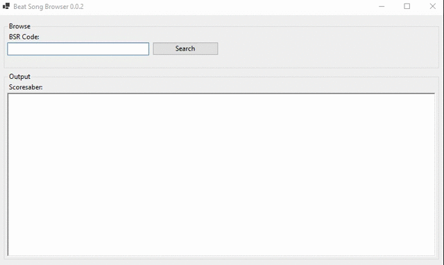

# Beat Song Browser
+ With this tool you can browse your songs in scoresaber via the BSR code

# Download
You can download the latest program [HERE](https://github.com/LicensedCrime/Beat-Song-Browser/releases/tag/0.0.3)

___

# Usage
+ Enter your code under "BSR Code" and press Enter or hit the "Search" button
+ Under "Scoresaber" you will see the difficulties and links to your given code
+ A click on a link automatically opens scoresaber in your favorite browser

# Bugs
+ all features

___

# Changelog

## 0.0.2
+ user agent adjustments
## 0.0.3
+ json parser fix...
+ dealing with empty responses
___

# Todo
+ watching for existing custom songs in the base game origin path
  + determine played and scored games
  + browsing in local files before searching on beat saver api
+ adding a playlist editor for ranked maps
  + eventually adding sort maps by star rating
+ making a downloader
  + downloading over mod assistant hooks
  + adjustments to the UI to make it more managable
+ more changes to go ...
